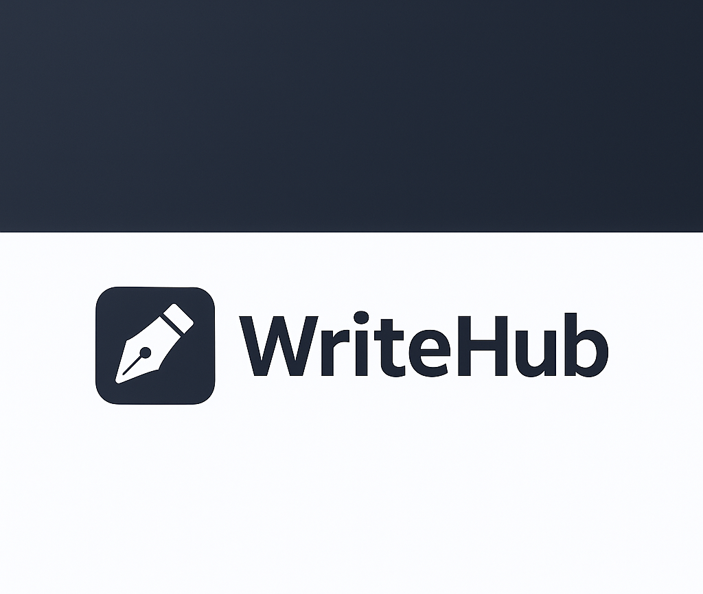
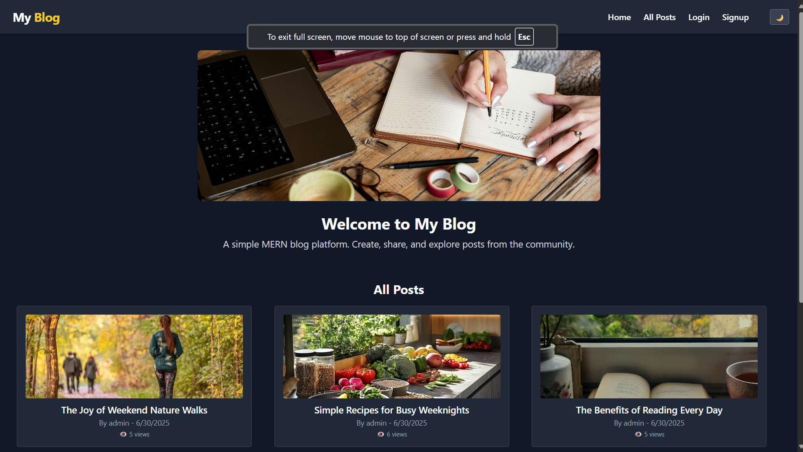
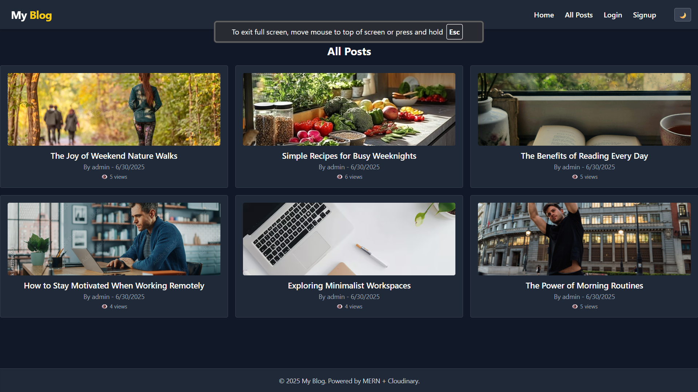
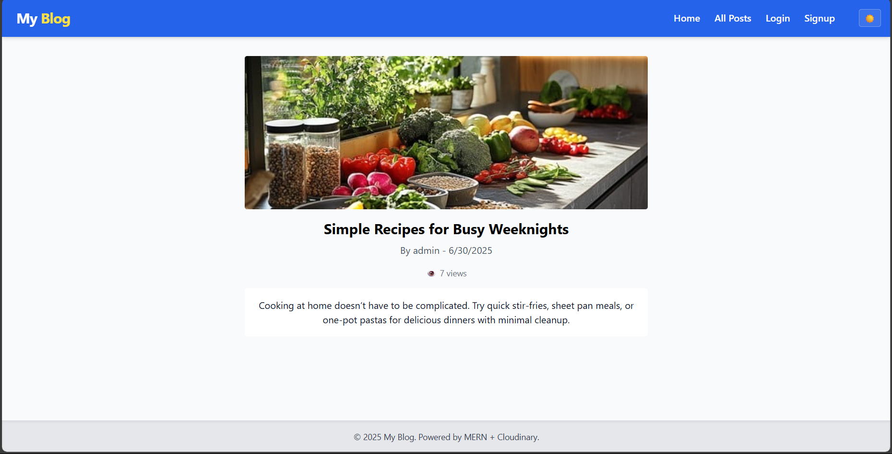
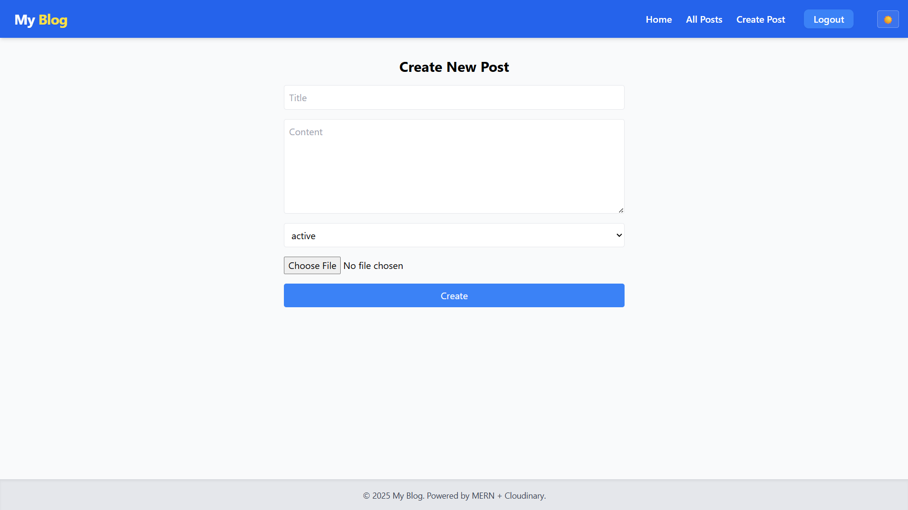
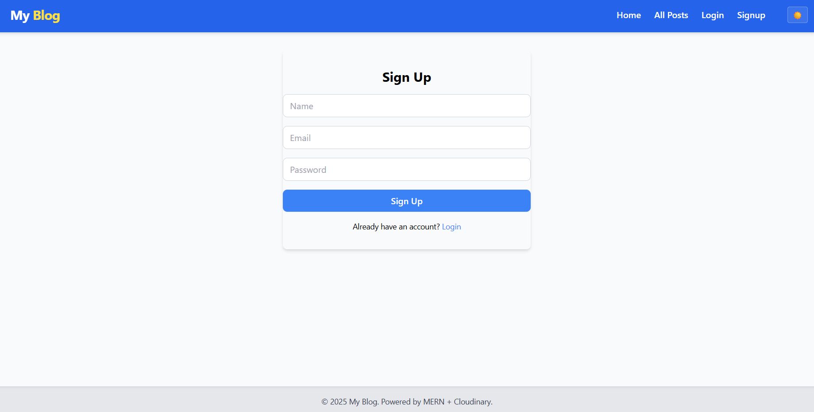

# WriteHub



## Tech Stack Used

<div align="center">
  
  
  
  
</div>

## Features
- Create, Read, Update, Delete (CRUD) blog posts
- User authentication (signup, login, logout)
- Image upload for posts
- Dark mode toggle

## How to Run

### 1. Server
- Go to the `server` folder
- Run `npm install`
- Run `npm start`
- The backend will start on port 5000

### 2. Client
- Go to the `client` folder
- Run `npm install`
- Run `npm run dev`
- The frontend will start on port 5173 (or similar)

## Folder Structure

```
project-root/
  client/      # React frontend
  server/      # Express backend
```

## Screenshots

### Application Screenshots

#### Home Page

*Main dashboard showing latest blog posts*

#### All Posts

*Complete list of all published blog posts*

#### Post Details

*Individual blog post view with full content*

#### Create Post

*Form for creating and editing blog posts*

#### Sign Up

*User registration page*
